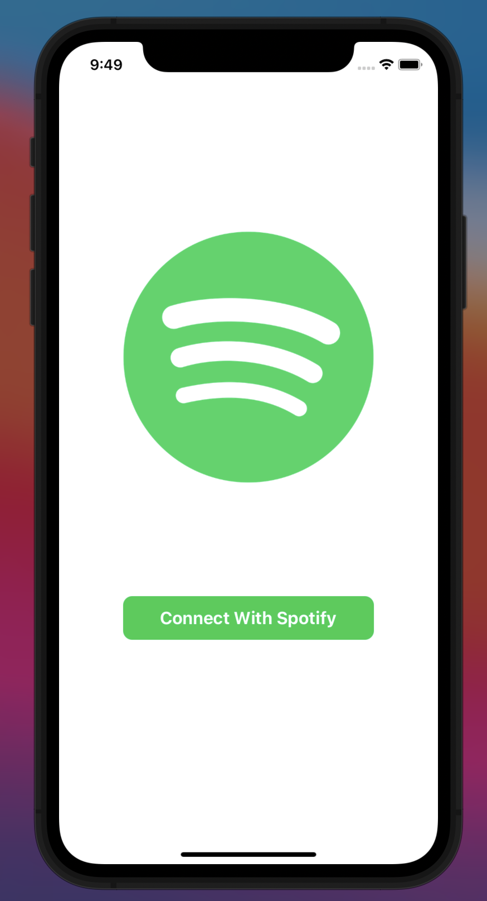
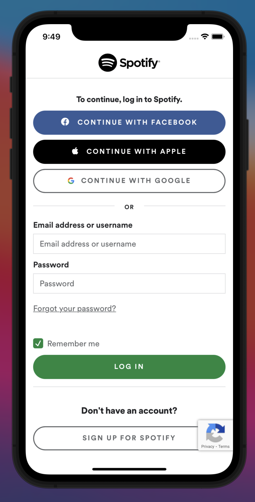
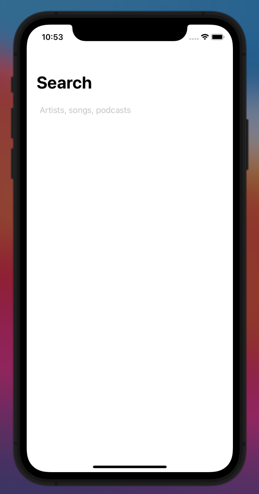
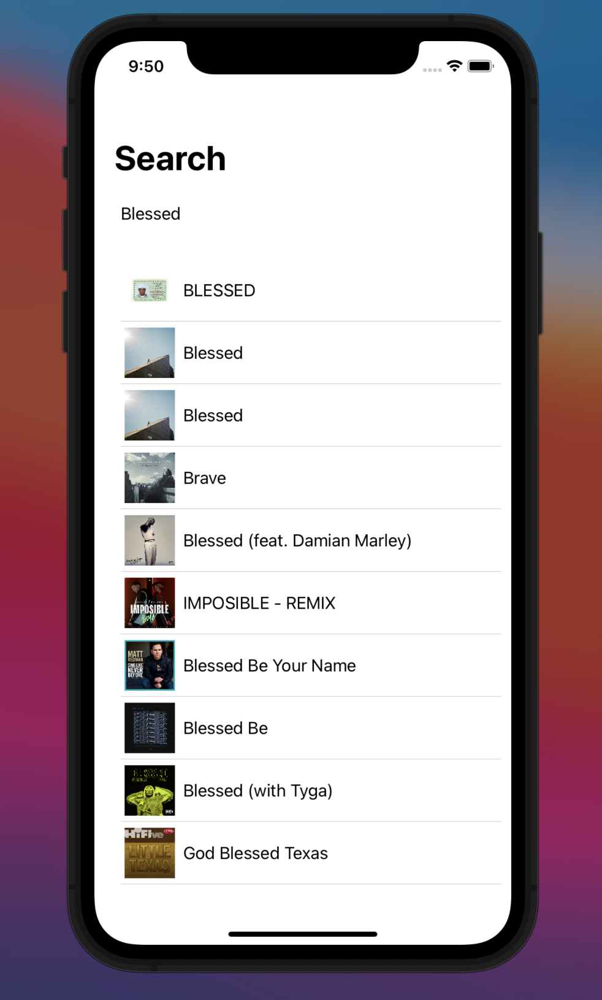

# iOS Mobile Application in Swift/SwiftUI: Spotify Search

## Description: 

Through this application, the user can perform search queries for spotify tracks. In order to keep the UI updated, I used a view model class that
held a `@Published` variable for the tracks to display on the screen, allowing the user to perform multiple searches.
To display the search results, I integrated SwiftUI views to represent a track and a list of tracks. Though the app is originally made in Storyboard/UIKit to handle 
`URLSessions` and `URLRequests` in a class called `HTTPClient` .  Lastly, in order for the aformentioned to work, the user must log in into their spotify account
to allow us to request data on their behalf. The authentication flow that I chose to follow was PKCE as Spotify recommends it for mobile applications that have 
secrets [(documentation)](https://developer.spotify.com/documentation/general/guides/authorization-guide/#authorization-code-flow-with-proof-key-for-code-exchange-pkce). 

## Challenges

While I was familar with HTTP requests, it was tougher than expected to implement them in Swift and it was probably the most time consuming task, specially using
PKCE. I admit that a TDD approach would have been tremendously helpful. 

## Todos
* Implement log out feature.
* Make tests on HTTPclient that use a `URLSession`

## Screenshots: 
Sign in        |  Authentication
:-------------------------:|:-------------------------:
  |  

Search          |  Search Query (after hitting enter)
:-------------------------:|:-------------------------:
  |  

## More

One library was used to make my life easier: [Kingfisher](https://github.com/onevcat/Kingfisher).
Kingfisher downloads and caches images from an URL as an extension of `UIImageView`. 
